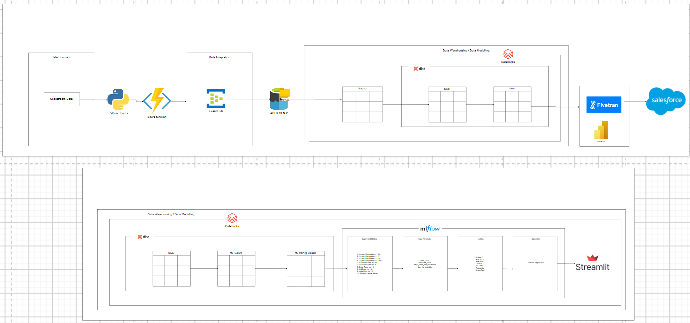

# Clickstream Lakehouse

An Azure and Databricks lakehouse that turns e-commerce clickstream activity into analytics tables, Salesforce visitor profiles, and a purchase-propensity application. The project covers ingestion, data cleaning, business metrics, feature engineering, model comparison, probability calibration, and local scoring through Streamlit.

The source is the RetailRocket dataset. Historical CSVs can be replayed through the ingestion service, while a Faker-based generator produces new synthetic activity for repeated pipeline runs.

## Architecture



[Open the full-size architecture diagram](ululul.png).

```text
RetailRocket CSVs / synthetic events
    -> Python producers
    -> Azure Function: POST /api/ingest/{source}
    -> Azure Event Hubs
    -> ADLS Gen2 Bronze: captured Avro files
    -> Databricks Auto Loader
    -> clickstream.staging: typed Delta tables
    -> dbt -> clickstream.silver: cleaned, deduplicated data
        |
        +-> clickstream.gold
        |       +-> Power BI connection and dashboard specification
        |       +-> Salesforce export view -> Fivetran Activations -> Salesforce Account
        |
        +-> clickstream.ml_feature
                -> clickstream.ml_training
                -> scikit-learn / XGBoost / LightGBM + MLflow
                -> isotonic calibration
                -> clickstream.ml_models.purchase_propensity
                -> Streamlit: ranked visitor-item purchase probabilities
```

Unity Catalog governs the Delta tables, model registry, and Databricks storage access. Auto Loader uses `trigger(availableNow=True)` to drain available captured files and stop; its configured job runs every 30 minutes. The full pipeline is launched on demand with [run_pipeline.py](run_pipeline.py).

## What the project delivers

| Component | Implementation |
|---|---|
| Ingestion | Three source-specific Event Hubs, an HTTP Azure Function, CSV replay, synthetic events, and Avro Capture to ADLS Gen2 |
| Lakehouse | Staging tables and 12 dbt models across Silver, Gold, ML Feature, and ML Training, with 25 declared data-quality tests |
| Analytics | Daily funnel, item performance, category performance, and visitor engagement marts |
| Salesforce | Stable export view and documented Fivetran upsert into the standard `Account` object |
| Machine learning | Ten candidates from six algorithm families, MLflow tracking, isotonic calibration, and Unity Catalog registration |
| Streamlit | Local application that loads a registered model and scores up to 20,000 unconverted visitor-item interactions |
| Power BI | Connection instructions, DAX measures, and a two-page dashboard specification; a finished `.pbix` report is not included |
| Infrastructure | Original Bicep templates and a Terraform recovery workflow, with fresh-deployment prerequisites listed below |

Recorded results describe earlier runs, rather than a live health check of the deployment:

- Full-data training is documented with **2,144,652 training rows** and **20,743 positive labels**. Calibrated LightGBM achieved approximately **0.395 PR-AUC**.
- The initial Salesforce activation is documented with **3,862 successful records**, **0 invalid**, and **0 rejected** records.
- [PIPELINE.md](PIPELINE.md) records a run on **2026-08-27**: **12/12 dbt models built**, **25/25 tests passed**, and model **version 9** registered, in **38.4 minutes**. The model-history documentation explains the calibration changes introduced in version 7.

## Repository structure

```text
.
|-- README.md                         Project overview and setup
|-- ululul.png                        Architecture diagram
|-- PIPELINE.md                       Pipeline options and recorded verification
|-- run_pipeline.py                   Ingest -> Auto Loader -> dbt -> train -> UI
|-- deploy.sh                         Terraform recovery and pipeline launch
|-- events.csv                        Historical clickstream events
|-- item_properties_part1.csv          Item-property history
|-- category_tree.csv                 Category hierarchy
|-- producer/                         CSV replay and Faker event producers
|-- ingestion_function/               Azure Functions ingestion service
|-- databricks/
|   |-- notebooks/                    Auto Loader, training, legacy diagnostics
|   `-- jobs/                         On-demand training job submission JSON
|-- dbt/
|   |-- models/silver/                Cleaning and current item attributes
|   |-- models/gold/                  Analytics marts and Salesforce export
|   |-- models/ml_feature/            Visitor-item features
|   |-- models/ml_training/           Binary purchase labels
|   `-- macros/                       Unity Catalog schema naming
|-- streamlit_app/                    Purchase-propensity UI and model history
|-- powerbi/                          Connection guide and DAX measures
|-- salesforce/                       Fivetran setup and Salesforce field mapping
|-- infra/                            Bicep, job specifications, and run exports
`-- terraform/                        Azure and Databricks recovery configuration
```

The root also includes PowerPoint presentations and scripts for generating or rendering presentation and standee assets. These are supporting materials, separate from the data pipeline.

## Source data and ingestion

Download the source files from the [RetailRocket recommender system dataset on Kaggle](https://www.kaggle.com/datasets/retailrocket/ecommerce-dataset), extract them, and place `events.csv`, `item_properties_part1.csv`, and `category_tree.csv` in the repository root. Kaggle may require sign-in to download the dataset. The producers resolve these paths from their own location, so no path configuration is needed.

The large events and item-property CSVs are excluded from Git and must be downloaded separately after cloning. Existing local copies remain available to the pipeline. `category_tree.csv` is small enough to be included in the repository. The current producer uses `item_properties_part1.csv`; the dataset's second item-property part is not ingested by that script.

| File | Source / Event Hub | CSV columns |
|---|---|---|
| `events.csv` | `events` | `timestamp`, `visitorid`, `event`, `itemid`, `transactionid` |
| `item_properties_part1.csv` | `item-properties` | `timestamp`, `itemid`, `property`, `value` |
| `category_tree.csv` | `category-tree` | `categoryid`, `parentid` |

Events use `view`, `addtocart`, and `transaction`. Item IDs are anonymized; the application displays numeric IDs because product names are unavailable. The named properties `categoryid` and `available` supply item category and availability.

[stream_clickstream.py](producer/stream_clickstream.py) sends paced CSV batches. [generate_fake_events.py](producer/generate_fake_events.py) samples existing visitor and item IDs, mixes in approximately 30% newly generated visitor IDs, and generates timestamps within the trailing 24 hours. Its configured event mix is approximately 96.67% views, 2.52% cart additions, and 0.82% transactions.

The [Azure Function](ingestion_function/function_app.py) accepts a non-empty `records` array and an optional `batch_id`. It adds ingestion time, source, and batch metadata, then sends records to the selected Event Hub using managed identity. Producers retry failed requests with backoff; Silver removes duplicate business events.

Event Hubs Capture is configured for Avro output with a 300-second / 300 MB capture window. Files land under `bronze/<source>/YYYY/MM/DD/HH/`. A successful HTTP ingestion response does not mean the capture files are already available to Auto Loader.

## Unity Catalog and dbt models

The catalog is `clickstream`. Bronze contains captured files in storage; Staging is their first queryable Delta representation.

| Schema | Tables / views | Purpose |
|---|---|---|
| `staging` | `events`, `item_properties`, `category_tree` | Auto Loader parses JSON from Avro `Body`, casts fields, and retains Event Hubs metadata; cleaning happens downstream |
| `silver` | `silver_events`, `silver_category_tree`, `silver_item_properties_history`, `silver_item_properties_current`, `int_item_attributes` | Quality filtering, deduplication, category cleanup, item-property history, and latest item attributes; `int_item_attributes` is a view |
| `gold` | `gold_daily_funnel`, `gold_item_performance`, `gold_category_performance`, `gold_visitor_summary`, `export_visitor_engagement_salesforce` | Business marts and a stable Salesforce export view |
| `ml_feature` | `ml_feature_visitor_item` | One row per `(visitor_id, item_id)`, with a Unity Catalog primary-key constraint applied by dbt post-hooks |
| `ml_training` | `ml_training_purchase_propensity` | Pairs with a view or cart addition, and binary `label_purchased` |
| `ml_models` | `purchase_propensity` | Registered MLflow model versions, rather than a dbt table |

The 12 dbt models comprise **10 tables and 2 views**. Tests cover not-null columns, unique keys, valid event types, and binary labels. [generate_schema_name.sql](dbt/macros/generate_schema_name.sql) routes models directly to their configured schemas.

Key transformation details:

- Event deduplication uses `(visitor_id, item_id, event, event_ts, transaction_id)` and keeps the most recently ingested copy.
- Current item properties select the latest change per `(item_id, property)`.
- Category performance rolls up to the directly assigned category, rather than recursively through the hierarchy.
- Feature recency uses the **maximum event timestamp in the dataset**, rather than wall-clock time.
- The feature table retains `transaction_count` for labels, candidate filtering, and purchase-history reporting. Model inputs exclude it.
- `gold_visitor_summary.distinct_items_viewed` counts distinct items across all event types. Summing daily unique-visitor counts does not produce a distinct multi-day count; the Power BI measures provide an all-time count from the visitor mart.

## Local setup

These commands use **PowerShell** and assume the Azure resources, Unity Catalog objects, captured data, and Databricks notebooks already exist. Read the infrastructure section before using a fresh workspace.

Requirements:

- Python **3.11** for the local environment; the Azure Function is also configured for Python 3.11.
- Azure CLI and Databricks CLI on `PATH`. Pipeline job commands use Azure CLI authentication.
- A Databricks personal access token for dbt/Streamlit and an Azure Function ingestion key.
- Access to the SQL warehouse, catalog, model registry, and configured job clusters.

From the repository root:

```powershell
python -m venv .venv
.\.venv\Scripts\Activate.ps1
python -m pip install -r producer/requirements.txt -r dbt/requirements.txt -r streamlit_app/requirements.txt

az login
$env:DATABRICKS_HOST = "https://adb-7405616477706025.5.azuredatabricks.net"
$env:DATABRICKS_AUTH_TYPE = "azure-cli"
```

Create or update a root `.env` with your values, without quotes around them:

```dotenv
DATABRICKS_TOKEN=<your-databricks-personal-access-token>
INGEST_FUNCTION_KEY=<your-azure-function-key>
```

`run_pipeline.py` loads this file without overriding existing environment variables. `.env` is ignored by Git. Direct producer, dbt, and Streamlit commands do **not** use this loader; set their variables in the shell:

```powershell
$env:DATABRICKS_TOKEN = "<your-databricks-personal-access-token>"
$env:INGEST_FUNCTION_KEY = "<your-azure-function-key>"
```

Deployment-specific values stored in the repository:

| Setting | Repository value |
|---|---|
| Resource group / region | `rg-clickstream-bronze` / `centralus` |
| Workspace hostname | `adb-7405616477706025.5.azuredatabricks.net` |
| SQL warehouse HTTP path | `/sql/1.0/warehouses/3ae0ca482ea10df2` |
| Ingestion base URL | `https://clickstream-func-yp6pon7lzod3o.azurewebsites.net` |
| Bronze storage account | `csbrzyp6pon7l` |
| Auto Loader job ID | `614669053635065` |

These identify the recorded deployment. Update the corresponding files for another workspace; setting `DATABRICKS_HOST` alone does not override the constants in `run_pipeline.py` or connection fields in `dbt/profiles.yml`.

## Run the pipeline

For an initialized deployment:

```powershell
python run_pipeline.py
```

The default run:

1. Generates and ingests **2,000 new synthetic events**.
2. Triggers Auto Loader and waits for completion.
3. Runs `dbt run` followed by `dbt test`.
4. Submits model training and waits for completion and registration.
5. Attempts a Fivetran sync only when `--trigger-fivetran` is supplied.
6. Restarts Streamlit on port **8501**, logging to `streamlit_app/streamlit.log`.

```powershell
# Generate more synthetic activity
python run_pipeline.py --count 10000

# Replay a historical events sample
python run_pipeline.py --replay-csv --max-rows 5000 --rate 200

# Rebuild dbt outputs from available Bronze files, without training or restarting the UI
python run_pipeline.py --skip-ingestion --skip-training --skip-streamlit
```

Default ingestion and replay modes send **events only**. They do not bootstrap item properties or the category hierarchy. For an initial dataset load, replay all three sources explicitly:

```powershell
$ingestUrl = "https://clickstream-func-yp6pon7lzod3o.azurewebsites.net"
python producer/stream_clickstream.py --source events --ingest-url $ingestUrl --function-key $env:INGEST_FUNCTION_KEY --max-rows 5000 --rate 200
python producer/stream_clickstream.py --source item-properties --ingest-url $ingestUrl --function-key $env:INGEST_FUNCTION_KEY --max-rows 500000 --rate 200
python producer/stream_clickstream.py --source category-tree --ingest-url $ingestUrl --function-key $env:INGEST_FUNCTION_KEY --rate 200
```

Omit `--max-rows` to replay an entire source. The small events sample checks ingestion; it does not reproduce the documented full-data model metrics. Wait for Capture files to land before starting downstream processing:

```powershell
python run_pipeline.py --skip-ingestion
```

The orchestrator has no explicit Capture wait or freshness check. An immediate Auto Loader run can finish while newly posted events are still waiting to be captured. Repeat downstream processing after the files appear if needed.

On Windows, restarting Streamlit attempts to force-stop any process listening on the selected port. Use `--skip-streamlit` to leave it alone, or choose `--streamlit-port <port>`. Training runs on every pipeline execution unless `--skip-training` is supplied. See [PIPELINE.md](PIPELINE.md) for all options.

## Run individual components

### Auto Loader

[autoloader_bronze_to_staging.py](databricks/notebooks/autoloader_bronze_to_staging.py) reads all three sources, appends managed Delta tables, and stores schema/checkpoint state under `/Volumes/clickstream/staging/checkpoints`.

```powershell
databricks jobs run-now 614669053635065
```

The configured job uses a single-node `Standard_D2ads_v6` cluster and Databricks Runtime `16.4.x-scala2.12`. It stops after draining available capture files.

### dbt transformations and checks

```powershell
Push-Location dbt
dbt debug --profiles-dir .
dbt run --profiles-dir .
dbt test --profiles-dir .
Pop-Location
```

[profiles.yml](dbt/profiles.yml) reads `DATABRICKS_TOKEN` and connects to the configured SQL warehouse. These commands build Silver, Gold, ML Feature, and ML Training; model fitting happens separately.

### Model training

```powershell
databricks jobs submit --json "@databricks/jobs/train_purchase_propensity_submit.json"
```

The [submission specification](databricks/jobs/train_purchase_propensity_submit.json) references `/Workspace/Shared/clickstream/train_purchase_propensity`, ML runtime `16.4.x-cpu-ml-scala2.12`, and a deployment-specific single-user identity. Update that identity and upload the notebook for your workspace.

### Streamlit application

For a standalone launch, set the hostname without the URL scheme for the SQL connector:

```powershell
$env:DATABRICKS_HOST = "adb-7405616477706025.5.azuredatabricks.net"
$env:DATABRICKS_TOKEN = "<your-databricks-personal-access-token>"
python -m streamlit run streamlit_app/app.py
```

Open `http://localhost:8501`. The app selects visitor-item pairs with `transaction_count = 0`, preselects up to 20,000 by cart/view activity, and sorts predictions from highest to lowest.

It displays visitor name, views, cart additions, recency, previously purchased item count, item ID, availability, probability, and a quartile-based meaning label. A visitor may have bought other items while remaining an unconverted candidate for this item. Purchase-history count is context, not a model input.

The app loads the highest registered version at startup and caches it for the process lifetime; restart after retraining. Candidate queries are cached for five minutes. Scoring runs locally after model download, without a Databricks Model Serving endpoint. See [streamlit_app/README.md](streamlit_app/README.md) for comparisons and model history.

## Purchase-propensity model

[train_purchase_propensity.py](databricks/notebooks/train_purchase_propensity.py) loads the training table into pandas and uses four inputs:

| Input | Meaning |
|---|---|
| `view_count` | Views for the visitor-item pair |
| `addtocart_count` | Cart additions for the pair |
| `days_since_last_interaction` | Recency relative to the latest dataset event |
| `item_is_available` | Item availability; missing training values are filled as false |

`label_purchased` is 1 when the pair has a recorded transaction, otherwise 0. `transaction_count` supplies the label and is excluded from inputs. `item_category_id` remains in the training table for reporting but is excluded from the model because numeric category IDs have no meaningful ordering.

Training proceeds as follows:

1. Creates a stratified **75% train / 25% test** split with `random_state=42`.
2. Compares four Logistic Regression regularization settings, two Random Forest depths, Extra Trees, XGBoost, LightGBM, and Gaussian Naive Bayes: **10 candidates across 6 families**.
3. Logs models, parameters, PR-AUC (average precision), ROC-AUC, positive-class metrics, probability spread, and low/high engagement stress scores to `/Shared/clickstream/purchase_propensity` in MLflow.
4. Prefers candidates passing the spread/stress checks, then selects the highest PR-AUC. **If none pass, the code warns and falls back to the highest PR-AUC candidate anyway.**
5. Rebuilds the winner inside `CalibratedClassifierCV(method="isotonic", cv=5)`, fits the training split, and prints predicted-versus-observed score bands on the test split.
6. Registers the calibrated model as `clickstream.ml_models.purchase_propensity`. The calibration table is diagnostic output, rather than another registration gate.

The recorded full-data winner was LightGBM: approximately **0.392 PR-AUC before calibration** and **0.395 afterward**. Later runs can choose another winner or produce different metrics. Local app requirements pin scikit-learn, LightGBM, and XGBoost to support serialized model loading.

Features and labels aggregate historical interactions without a defined future purchase window or point-in-time feature cutoff. Evaluation uses a random pair-level split and reuses the test split for selection and final reporting. These results describe historical classification; prospective forecasting requires time-based feature/label windows and an independent final evaluation set. Synthetic refresh events also change the dataset's time reference and distribution.

## Analytics and Salesforce

**Power BI:** [powerbi/README.md](powerbi/README.md) describes the Databricks connection and Executive Overview / Item & Category Performance pages. [measures.dax](powerbi/measures.dax) provides funnel, conversion, visitor, item, and category measures. The report still needs authoring and connection in Power BI Desktop.

**Salesforce:** Fivetran Activations reads `clickstream.gold.export_visitor_engagement_salesforce` and upserts standard `Account` records. `visitor_id` maps to unique external ID `Visitor_Id__c`; `account_name` supplies `Name`, and engagement columns map to eight custom fields. The documented schedule is daily at **09:00 UTC / 14:00 Pakistan time**. [salesforce/README.md](salesforce/README.md) contains setup, mappings, and initial results.

The optional `--trigger-fivetran` flag needs `FIVETRAN_API_KEY`, `FIVETRAN_API_SECRET`, and `FIVETRAN_SYNC_ID`. It calls a standard connector force endpoint and has **not been verified for Activations** in this project. Pipeline success does not establish that this optional trigger worked; failures are logged and processing continues.

## Infrastructure and recovery

[infra/main.bicep](infra/main.bicep) defines Bronze storage, Function runtime storage, Event Hubs/Capture, Function App, telemetry, and role assignments. [infra/databricks.bicep](infra/databricks.bicep) adds the Databricks Premium workspace and managed-identity Access Connector.

[terraform/](terraform/) contains recovery definitions for Azure resources, Function ZIP deployment, Databricks workspace, storage credential, external locations, catalog, six schemas, two production notebooks, and the scheduled Auto Loader job. It expects a workspace-assigned Unity Catalog metastore and a warehouse named `Serverless Starter Warehouse` to exist.

[deploy.sh](deploy.sh) is a Bash recovery script requiring Terraform **1.5+**, Azure CLI, Databricks CLI, Python, and local dependencies. On Windows, use a Bash environment such as Git Bash with those tools available. Review the configuration before executing:

```bash
bash deploy.sh
```

The script runs Terraform with automatic approval, patches selected workspace/warehouse/job references, overwrites `.env` with a Function key and fresh PAT, then launches the pipeline. Its stale-catalog provisioner can delete the existing `clickstream` catalog with cascade semantics when that provisioner runs, including on fresh Terraform state. Use this workflow only for an intended rebuild.

Current recovery prerequisites and incomplete steps:

- The patch script updates workspace hosts, warehouse IDs, and the Auto Loader job ID, but leaves the ingestion URL in `run_pipeline.py`, the Bronze account in the Auto Loader notebook, and the training submission's user identity unchanged. Update them for a new deployment and upload the adjusted notebook.
- Auto Loader requires the `clickstream.staging.checkpoints` volume; Terraform does not declare it. Create the volume before running ingestion jobs.
- Recovery generates synthetic events only. Bootstrap item properties, categories, and required historical events separately.
- Training remains an on-demand submission, rather than a Terraform-managed recurring job.
- Fivetran connections, Salesforce fields/mappings, OAuth grants, and the Power BI report require separate configuration.

Function-to-Event-Hubs and Databricks-to-ADLS access use managed identities. Function runtime storage still uses a storage account key, local dbt/Streamlit uses a PAT, and HTTP ingestion uses a Function key.

## Troubleshooting and operations

| Symptom | Check |
|---|---|
| Databricks CLI missing | Add it to `PATH`; the orchestrator also checks `~/databricks-cli/databricks.exe` |
| Jobs cannot authenticate | Run `az login`, confirm workspace access, host, and single-user identity |
| dbt cannot connect | Check token expiry, warehouse availability, and `dbt/profiles.yml` |
| Newly ingested data is absent | Wait for Capture; check Bronze paths and checkpoint volume, then rerun Auto Loader and dbt |
| Streamlit shows an older model | Restart the process to clear the cached model |
| Model loading fails locally | Install pinned dependencies in `streamlit_app/requirements.txt` |
| Fivetran flag does not sync records | Inspect warnings and verify the Activation sync in Fivetran; the optional trigger is unverified |

`databricks/notebooks/verify_counts.py` references an older `clickstream.raw` layout, and `test_purchase_propensity_model.py` is pinned to version 1 with an older feature list. Adapt them to current staging tables and the four model features before using them for validation.

The local pipeline has no continuous scheduler for dbt or training. Auto Loader and the documented Fivetran schedule operate independently. Event Hubs, storage, Function execution, job compute, and SQL warehouse activity incur cloud usage costs; stopping a local script does not remove deployed resources.

## Further documentation

- [Published Vivan Case Study Wiki](https://github.com/Muhammad-Hamza69/Databricks-Azure-Fintech-Case-Study/wiki/Case-Study-Blog)
- [Vivan case study and wiki source](wiki/Case-Study-Blog.md): business context, data centralization, architecture, analytics, and purchase-propensity modeling. [Wiki publishing instructions](wiki/README.md).
- [Pipeline usage and recorded verification](PIPELINE.md)
- [Streamlit application and model history](streamlit_app/README.md)
- [Salesforce activation setup and mappings](salesforce/README.md)
- [Power BI connection and dashboard specification](powerbi/README.md)
- [Presentation](Clickstream_Lakehouse_Presentation_v3.pptx)
