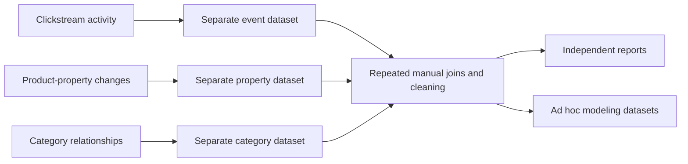
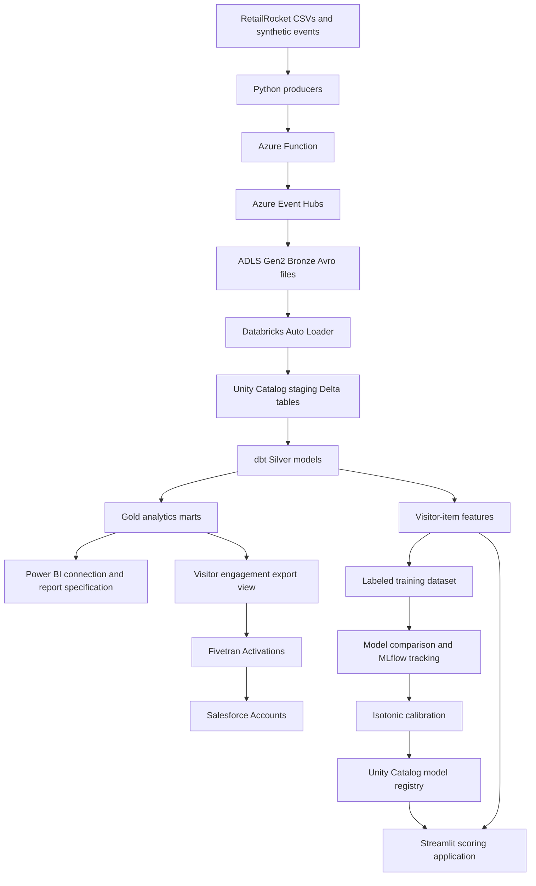

# Centralizing Vivan's E-commerce Data with Azure Databricks and Purchase-Propensity Modeling

**A technical case study: from decentralized customer activity and product data to a governed lakehouse, reusable analytics, and calibrated purchase scores.**

Vivan's modernization project connects data engineering with a practical business question: which visitor-item interactions should the business prioritize when a purchase has not yet happened? The platform brings clickstream events, item properties, and category relationships into one governed analytical environment, then uses that foundation for reporting, Salesforce activation, and machine learning.

This implementation uses public RetailRocket data and generated synthetic events to represent Vivan's e-commerce workflows. Implementation details and recorded results below come from the repository; the legacy business scenario explains the modernization objective without implying access to Vivan's proprietary production systems.

## Table of contents

1. [Introduction](#1-introduction)
2. [Vivan's business context](#2-vivans-business-context)
3. [Problem statement](#3-problem-statement)
4. [Challenges in the decentralized data environment](#4-challenges-in-the-decentralized-data-environment)
5. [Original data architecture](#5-original-data-architecture)
6. [The modernization approach](#6-the-modernization-approach)
7. [Target architecture](#7-target-architecture)
8. [Technology choices](#8-technology-choices)
9. [End-to-end data flow](#9-end-to-end-data-flow)
10. [Data sourcing and event generation](#10-data-sourcing-and-event-generation)
11. [Bronze storage and staging ingestion](#11-bronze-storage-and-staging-ingestion)
12. [Silver transformations and data quality](#12-silver-transformations-and-data-quality)
13. [Gold analytics and shared business metrics](#13-gold-analytics-and-shared-business-metrics)
14. [Feature engineering and labeled training data](#14-feature-engineering-and-labeled-training-data)
15. [Model comparison and selection](#15-model-comparison-and-selection)
16. [Probability calibration and model evolution](#16-probability-calibration-and-model-evolution)
17. [Streamlit prediction application](#17-streamlit-prediction-application)
18. [Salesforce activation and Power BI](#18-salesforce-activation-and-power-bi)
19. [Orchestration and observability](#19-orchestration-and-observability)
20. [Infrastructure, identity, and governance](#20-infrastructure-identity-and-governance)
21. [Recorded outcomes and business value](#21-recorded-outcomes-and-business-value)
22. [Current limits and future improvements](#22-current-limits-and-future-improvements)
23. [Engineering takeaways and conclusion](#23-engineering-takeaways-and-conclusion)
24. [References and implementation evidence](#24-references-and-implementation-evidence)

## 1. Introduction

An e-commerce interaction is useful only when it can be connected to the context around it. A view indicates interest, an add-to-cart indicates stronger intent, and a transaction records conversion. Product availability and category membership help explain those interactions, but they often arrive through separate operational data flows.

The Vivan project centralizes these domains in an Azure Databricks lakehouse. Python producers and an Azure Function feed Azure Event Hubs, captured events land in Azure Data Lake Storage Gen2, and Databricks Auto Loader turns them into queryable Delta tables. dbt then creates cleaned data, business marts, features, and labeled training rows. MLflow records model experiments and registers calibrated models for the Streamlit application.

The result is a shared foundation for understanding customer behavior and experimenting with purchase prediction.

## 2. Vivan's business context

Vivan is the e-commerce platform used as the business context for this case study. Its analytical requirements span three related domains:

| Domain | Business question | Data needed |
|---|---|---|
| Customer engagement | Where do visitors move from browsing to cart activity and purchase? | Visitor IDs, item IDs, event types, and timestamps |
| Product performance | Which items and categories attract engagement and convert? | Clickstream history, category membership, and availability |
| Customer activation | Which unconverted interactions deserve attention? | Visitor summaries and purchase-propensity scores |

Centralization makes these questions answerable from shared tables rather than repeatedly assembling separate files. Marketing can use visitor engagement summaries, analysts can compare item and category performance, and model development can reuse the same cleaned interaction history.

The source data contains anonymous visitor and item identifiers. Real customer names, email addresses, product names, order values, and payment details are outside this implementation's dataset.

## 3. Problem statement

The project addresses fragmented analytical data: clickstream activity, product-property changes, and category relationships exist as separate inputs. Without a shared ingestion and transformation process, every report or model needs to reconstruct its own joins, filters, and definitions.

That fragmentation creates four practical problems:

- **Disconnected customer behavior:** identifying an unconverted visitor-item interaction requires consolidating views, cart additions, and transactions.
- **Inconsistent business metrics:** separate reporting logic can produce different definitions of engagement and conversion.
- **Repeated data preparation:** teams must clean duplicates, cast fields, and select current item properties before each analysis.
- **Limited prediction capability:** model development lacks a reproducible feature table, labeled dataset, and versioned model lifecycle.

The objective was to establish a centralized platform that supplies these reusable data products and supports a purchase-propensity model on top of them.

## 4. Challenges in the decentralized data environment

| Challenge | Effect on the business workflow | Design response |
|---|---|---|
| Separate event, item, and category inputs | Analysts must reconcile keys across datasets | Typed staging tables and conformed Silver models |
| Replayed events or request retries | Duplicate rows can distort funnel counts | Business-key deduplication before aggregation |
| Product-property changelogs | Reporting can use an outdated category or availability value | History preservation and a latest-value snapshot |
| Repeated metric logic | Reports and exports can disagree | Shared Gold marts and a stable export contract |
| Ad hoc model experiments | Results are difficult to compare or reproduce | MLflow tracking and Unity Catalog registration |
| Inflated model probabilities | A ranking score can be mistaken for purchase certainty | Isotonic calibration and observed-rate diagnostics |

These challenges define the design scenario. The repository does not establish measured legacy query latency, legacy cloud spend, or a before-and-after revenue uplift.

## 5. Original data architecture

The diagram below represents the decentralized starting point. It describes the analytical silos being addressed, rather than a discovered inventory of Vivan's production applications.



The architectural gap is the absence of a governed, reusable data layer between the source domains and their consumers.

## 6. The modernization approach

The solution uses five engineering principles:

1. **Centralize the analytical foundation.** Land the different source domains in ADLS Gen2 and govern their queryable representations through Unity Catalog.
2. **Separate ingestion from business logic.** Producers, the Function, Event Hubs, and Auto Loader handle movement and typing; dbt handles cleaning and business transformations.
3. **Publish reusable data products.** Silver data supports Gold reporting, Salesforce exports, feature engineering, and labels.
4. **Make the model lifecycle reviewable.** Compare candidates with logged metrics, inspect stress behavior, calibrate the selected model, and register a version.
5. **Make execution repeatable.** Use a local pipeline orchestrator, checked-in notebooks, dbt models, and infrastructure definitions.

The lakehouse centralizes data and governance while retaining separate compute paths for job execution, warehouse SQL, and local application scoring.

## 7. Target architecture


[Open the full-size architecture diagram](https://github.com/Muhammad-Hamza69/Databricks-Azure-Fintech-Case-Study/blob/main/ululul.png).



The diagram shows implemented data and modeling paths together with downstream reporting preparation. Power BI is represented by connection instructions and DAX measures; the repository does not include a finished report file.

## 8. Technology choices

| Technology | Role in the implementation | Reason it fits the workflow |
|---|---|---|
| Python | CSV replay, synthetic events, and orchestration | Simple control over batches, pacing, and job execution |
| Azure Functions | Authenticated HTTP ingestion | A single ingestion contract for all three sources |
| Azure Event Hubs | Event transport and Capture | Buffers events and lands Avro archives for downstream ingestion |
| ADLS Gen2 | Bronze and managed table storage | Persistent storage shared across processing stages |
| Azure Databricks / Delta | Auto Loader and lakehouse tables | Incremental file discovery and typed, queryable data |
| Unity Catalog | Catalog, schemas, storage access, and model registry | Shared governance across analytics and modeling |
| dbt-databricks | SQL transformations and data tests | Versioned dependencies, named models, and repeatable checks |
| scikit-learn, XGBoost, LightGBM | Classification and calibration | Multiple algorithm families for tabular behavior data |
| MLflow | Experiments, model artifacts, and registration | Traceable candidate comparison and versioned model loading |
| Streamlit | Interactive scoring application | Makes predictions accessible without running a notebook |
| Fivetran Activations / Salesforce | Visitor engagement activation | Upserts shared analytics into a CRM workflow |
| Power BI | Planned report consumption | Uses prepared Gold metrics and checked-in DAX measures |
| Bicep / Terraform | Infrastructure definitions | Documents cloud resource configuration and recovery steps |

## 9. End-to-end data flow

1. A producer reads a source CSV or creates synthetic events and sends batches to `POST /api/ingest/{source}`.
2. The Function validates the batch envelope, adds ingestion/source/batch metadata, and sends records to the corresponding Event Hub.
3. Event Hubs Capture writes Avro files into the Bronze container.
4. Auto Loader reads the Avro `Body` payload, parses JSON, casts source fields, and appends typed records to `clickstream.staging`.
5. dbt filters invalid rows, removes duplicate business events, cleans categories, and builds item-property history and current attributes in Silver.
6. Gold models publish funnel, item, category, and visitor metrics. A separate view defines the Salesforce export contract.
7. Feature models aggregate visitor-item behavior. The training model adds binary purchase labels.
8. The training notebook compares classifiers, calibrates the selected architecture, and registers the model through MLflow.
9. Streamlit reads unconverted visitor-item candidates, loads the latest registered version at process startup, and displays ranked probabilities.

The capture boundary matters operationally: an accepted HTTP request can precede the arrival of its Bronze files. Running downstream jobs immediately does not guarantee that the newest events have already reached the tables.

## 10. Data sourcing and event generation

The implementation uses the [RetailRocket recommender system dataset](https://www.kaggle.com/datasets/retailrocket/ecommerce-dataset):

| Source | Key fields | Analytical use |
|---|---|---|
| `events.csv` | Timestamp, visitor ID, event, item ID, transaction ID | Customer interaction and purchase history |
| `item_properties_part1.csv` | Timestamp, item ID, property, value | Product attributes and their changes |
| `category_tree.csv` | Category ID, parent category ID | Category relationships |

The CSV producer replays each source through the Function. Data is not loaded directly into tables, so the ingestion path is exercised during backfills as well as demonstrations.

The Faker producer creates new events because replaying the same historical events repeatedly would mostly reproduce duplicates that Silver removes. It samples existing IDs from a reference pool, mixes in approximately 30% newly generated visitor IDs, spreads timestamps over the trailing 24 hours, and uses an event mix of approximately 96.67% views, 2.52% cart additions, and 0.82% transactions.

Large CSVs are deliberately excluded from the Git repository. Download them separately and place them at the root as explained in the [project setup](https://github.com/Muhammad-Hamza69/Databricks-Azure-Fintech-Case-Study#source-data-and-ingestion). The current item-property producer reads the first part only.

## 11. Bronze storage and staging ingestion

Bronze is an ADLS Gen2 container holding captured Avro files under source/date/hour paths. Capture is configured for a 300-second / 300 MB window. These are ingestion settings, not a measured five-minute end-to-end service-level guarantee.

The Auto Loader notebook reads each source using `cloudFiles` with Avro format. The payload arrives as a JSON string in `Body`; the notebook parses it, converts source timestamps and identifiers, and preserves Event Hubs enqueue time, sequence number, and offset.

Three staging tables form the first queryable layer:

- `clickstream.staging.events`
- `clickstream.staging.item_properties`
- `clickstream.staging.category_tree`

Schema and checkpoint state live under `/Volumes/clickstream/staging/checkpoints`. Each job uses `trigger(availableNow=True)`, drains the files available since its checkpoint, and stops. The job definition schedules it every 30 minutes on an ephemeral single-node cluster.

Staging preserves source delivery history. Quality filtering and deduplication belong to Silver, rather than being hidden inside the ingestion step.

## 12. Silver transformations and data quality

The Silver layer makes the source data reusable:

| Model | Transformation |
|---|---|
| `silver_events` | Requires visitor/item IDs and event timestamps, accepts only known event types, and removes duplicate business events |
| `silver_category_tree` | Requires category IDs, removes self-referencing parents, and keeps the latest ingested category record |
| `silver_item_properties_history` | Preserves property changes while removing exact redeliveries |
| `silver_item_properties_current` | Selects the latest value for each item/property pair |
| `int_item_attributes` | Pivots `categoryid` and `available` into an item-level view |

Event deduplication partitions by visitor, item, event type, event timestamp, and transaction ID, keeping the most recently ingested copy. This protects aggregate metrics when producer retries or CSV replays deliver the same business event again.

The project defines **25 dbt tests** across Silver, Gold, ML Feature, and ML Training. They check not-null values, unique keys, valid event types, and binary labels. These are targeted column/key checks; the implementation does not add a complete referential-integrity or category-cycle validation framework.

There are **12 dbt models: 10 tables and 2 views**. The configured table models rebuild on `dbt run`; incremental ingestion into staging does not make the downstream dbt transformations incremental.

## 13. Gold analytics and shared business metrics

Gold translates cleaned records into business data products:

| Model | Grain | Main measures |
|---|---|---|
| `gold_daily_funnel` | Day | Views, cart additions, transactions, daily unique visitors, view-to-purchase rate |
| `gold_item_performance` | Item | Engagement counts, unique visitors, conversion rate, category, availability |
| `gold_category_performance` | Direct category | Item count, engagement counts, transactions, conversion rate |
| `gold_visitor_summary` | Visitor | Engagement totals, distinct items, first/last seen, conversion flag |
| `export_visitor_engagement_salesforce` | Visitor | Stable CRM export columns and generated account name |

These marts are aggregate analytical products rather than a full dimensional star schema. Category performance rolls up to directly assigned categories, not recursively through the category hierarchy.

Metric semantics matter. The item and daily conversion measures divide transaction-event counts by view-event counts. The visitor conversion flag indicates whether any transaction was recorded. The field named `distinct_items_viewed` counts distinct items across the visitor's events, rather than restricting the count to view events.

For reporting, daily distinct-visitor counts cannot be summed into a true distinct count over several days. The checked-in DAX measures use the one-row-per-visitor summary for an all-time visitor count.

## 14. Feature engineering and labeled training data

The feature grain is **one visitor interacting with one item**. This is the correct level for asking whether the visitor has converted on that particular product, even if they have already purchased other products.

`clickstream.ml_feature.ml_feature_visitor_item` includes identifiers, view/cart/transaction counts, first and last interaction timestamps, recency, category, and availability. dbt post-hooks declare `(visitor_id, item_id)` as a Unity Catalog primary key. Training reads the resulting table-derived dataset directly; the code does not perform automated feature lookup through a Feature Engineering client.

The classifier uses four features:

| Feature | Model input meaning |
|---|---|
| `view_count` | Number of views for the visitor-item pair |
| `addtocart_count` | Number of cart additions for that pair |
| `days_since_last_interaction` | Days between its last interaction and the latest event in the dataset |
| `item_is_available` | Current availability indicator; missing training values are filled as false |

Recency uses the dataset's latest timestamp so the historical dataset can be evaluated without comparing old interactions to today's date.

`ml_training_purchase_propensity` retains pairs with a view or cart addition and creates `label_purchased = 1` when `transaction_count > 0`, otherwise 0. Transaction count stays available in the feature table for labeling and application filtering, but is excluded from classifier inputs. Category ID is retained for reporting and excluded as a numeric predictor because its magnitude does not encode a meaningful ordering.

The historical labels do not define a future purchase window. A production forecasting dataset would need features frozen at a decision time and labels calculated from purchases occurring afterward.

## 15. Model comparison and selection

The training notebook loads the data into pandas and creates a stratified 75% training / 25% test split using `random_state=42`. It compares **10 candidates across six algorithm families**:

| Algorithm family | Candidate settings |
|---|---|
| Logistic Regression | `C = 1.0, 0.1, 0.01, 0.001` |
| Random Forest | Maximum depth 6 and 3, with 200 trees |
| Extra Trees | Maximum depth 6, with 200 trees |
| XGBoost | Maximum depth 6, with 200 estimators |
| LightGBM | Maximum depth 6, with 200 estimators |
| Gaussian Naive Bayes | One candidate |

The main selection metric is average precision, logged as `pr_auc`. Positive purchase examples are relatively rare: the documented full-data training set contains 20,743 positives among 2,144,652 rows, approximately 0.97%. Average precision therefore provides a useful view of ranking quality alongside ROC-AUC and positive-class precision/recall.

MLflow logs candidate parameters, model artifacts, PR-AUC, ROC-AUC, positive-class metrics, probability spread, and hand-built stress scores. Candidates are preferred when probability standard deviation is at least 0.02, the low-engagement stress score is at most 0.50, and the high-minus-low engagement gap is at least 0.30.

These checks are preference rules in the current implementation. If every candidate fails them, the notebook emits a warning and selects the highest PR-AUC candidate anyway. It does not block registration in that case.

The recorded full-data comparison in the application documentation includes:

| Candidate | Average precision / PR-AUC | ROC-AUC |
|---|---:|---:|
| LightGBM, depth 6 | 0.3916 | 0.9726 |
| XGBoost, depth 6 | 0.3893 | 0.9720 |
| Random Forest, depth 6 | 0.3890 | 0.9741 |
| Random Forest, depth 3 | 0.3657 | 0.9724 |
| Logistic Regression, C=0.1 | 0.3421 | 0.9699 |
| Extra Trees, depth 6 | 0.3240 | 0.9702 |
| Gaussian Naive Bayes | 0.2825 | 0.9685 |

The top three candidates were close. LightGBM won the recorded comparison by the selected ranking metric, rather than by every possible metric. Subsequent pipeline runs can select a different winner.

## 16. Probability calibration and model evolution

A useful ordering of customers does not automatically provide trustworthy probabilities. Class weighting helped the classifiers address imbalance, but it also inflated their raw scores. The repository records an independent check in which rows receiving raw scores in the 90–100% band converted only about 31% of the time.

The model evolved through several stages:

| Stage | Finding | Engineering change |
|---|---|---|
| Early versions | A small positive sample produced saturated probabilities | Tuned regularization and inspected probability spread |
| Feature correction | Numeric category IDs encouraged unreliable relationships | Removed category ID from model inputs |
| Stress testing | Held-out ranking metrics could conceal implausible examples | Added contrasting low/high engagement examples |
| Full-data training | Demo-scale samples contained too few purchases | Expanded to the full event dataset |
| Wider comparison | Two families did not cover enough alternatives | Added Extra Trees, XGBoost, LightGBM, and Naive Bayes |
| Calibration | Strong ranking still produced inflated raw probabilities | Applied five-fold isotonic calibration |

The winning architecture is rebuilt inside `CalibratedClassifierCV(method="isotonic", cv=5)`. Calibration uses the training split; the held-out split is used to print predicted-versus-observed score bands. The calibrated artifact is registered as `clickstream.ml_models.purchase_propensity`.

Recorded diagnostics include an average prediction near 34.9% versus an observed purchase rate near 35.5% for one band, and average precision around 0.395 after calibration. These describe a historical evaluation, not a guarantee that the same probability calibration will hold after customer behavior or data distributions change.

The calibration table is printed for inspection, not enforced as another registration gate. The held-out split is also reused for candidate selection and final reporting, so a separate final evaluation set is still needed for a stronger deployment assessment.

## 17. Streamlit prediction application

The application makes the trained model usable without notebook interaction. It queries pairs with `transaction_count = 0`, orders candidates by cart and view activity, and retrieves up to **20,000** rows for local scoring.

This is a preselected candidate pool. It is not an exhaustive ranking of every unconverted interaction in the lakehouse, and its meaning labels are relative to the scored pool.

For each candidate, the UI shows:

- Visitor name generated from the anonymous visitor ID.
- View and add-to-cart counts.
- Days since last interaction.
- Previously purchased distinct item count for that visitor.
- Item ID and availability.
- Calibrated model probability and a quartile-based tendency label.

Previous purchase count supplies context rather than a classifier feature. A repeat buyer can still be an unconverted candidate for a different item.

The app resolves the highest registered model version when it starts, caches the model for the process lifetime, and caches candidate queries for five minutes. Restarting it after training loads the new version. Predictions run locally after downloading the serialized model; there is no deployed Model Serving endpoint in this implementation.

Business users can use the ranked candidates to explore outreach priorities or investigate stronger purchase signals. Campaign execution, consent management, identity resolution, and measured campaign uplift are separate operational steps.

## 18. Salesforce activation and Power BI

### Salesforce visitor engagement

Fivetran Activations reads `clickstream.gold.export_visitor_engagement_salesforce` and upserts Salesforce's standard `Account` object. One anonymous visitor becomes one Account with a generated name such as `Visitor 629333`.

`visitor_id` maps to the unique external-ID field `Visitor_Id__c`. The required Account `Name` comes from `account_name`; engagement values map to eight custom fields covering the visitor ID, views, cart additions, transactions, distinct items, first/last seen, and conversion status.

The repository documents an initial sync of **3,862 successful records**, with **0 rejected** and **0 invalid** records. Its configured schedule is daily at **09:00 UTC / 14:00 Pakistan time**. This activation exports visitor engagement; it does not currently export the model's propensity scores to Salesforce.

The pipeline's optional API trigger is distinct from that configured integration. It calls a standard connector force endpoint and is not verified for Activations. The daily sync is documented independently of that optional trigger.

### Power BI analytics

The repository supplies Databricks connection instructions and DAX measures for two report pages:

1. **Executive Overview:** funnel totals, visitor conversion, and activity trends.
2. **Item and Category Performance:** item/category engagement, conversion comparisons, and availability.

These describe an Import-mode report design. A completed `.pbix` dashboard and its refresh schedule are not delivered artifacts in the repository.

## 19. Orchestration and observability

`run_pipeline.py` connects six stages:

```text
Generate/replay events -> Auto Loader -> dbt run + test
    -> model training -> optional Fivetran trigger -> Streamlit restart
```

The default is 2,000 new synthetic events, followed by transformation, training, and UI restart. CLI flags support CSV replay, skipping ingestion, skipping training, skipping the UI restart, changing the Streamlit port, and attempting the optional activation trigger.

The orchestrator polls Databricks run state and stops when required processing fails. dbt tests check the declared data contracts, MLflow records modeling evidence, Application Insights supports Function telemetry, and the Streamlit launch writes a local log.

These are useful operational signals, but the current project does not implement a unified SLA control table, end-to-end freshness alerts, automated drift monitoring, or a continuous production scheduler for dbt and training.

Two scheduling details affect expectations: Auto Loader runs on its own 30-minute schedule, and the documented Fivetran activation runs daily. The complete pipeline is launched locally on demand. The recorded end-to-end execution took 38.4 minutes, including training, rather than meeting a sub-minute prediction-refresh SLA.

## 20. Infrastructure, identity, and governance

The original infrastructure is described in Bicep. Terraform adds definitions for the Azure resources, Function deployment package, Databricks workspace, Access Connector, storage credential, external locations, catalog, six schemas, two production notebooks, and Auto Loader job.

Unity Catalog organizes the centralized platform into `staging`, `silver`, `gold`, `ml_feature`, `ml_training`, and `ml_models`. Separating schemas makes the role of each data product visible and provides a foundation for access policies.

The implemented identity paths are:

| Connection | Authentication |
|---|---|
| Producer to Function | Function key |
| Function to Event Hubs | Managed identity with Data Sender role |
| Event Hubs Capture to storage | Storage write role assigned to the namespace identity |
| Databricks to ADLS | Access Connector managed identity through Unity Catalog storage configuration |
| Local Databricks job commands | Azure CLI authentication |
| dbt and Streamlit | Databricks PAT |
| Function runtime storage | Storage account key in runtime configuration |

Secrets are kept out of checked-in `.env` contents; `.env` is ignored by Git. Terraform state can contain sensitive infrastructure values and is also ignored locally. The repository does not configure a remote state backend, Key Vault integration, or complete deployment-specific catalog grants.

`deploy.sh` is an intended recovery workflow, not a fully automatic migration of every integration. It can drop an existing `clickstream` catalog when its stale-catalog provisioner runs. Current gaps include an undeclared checkpoint volume, unchanged ingestion/storage/user references, separate source-data bootstrapping, and manual Salesforce/Fivetran/Power BI setup. Review the [recovery notes](https://github.com/Muhammad-Hamza69/Databricks-Azure-Fintech-Case-Study#infrastructure-and-recovery) before using it.

## 21. Recorded outcomes and business value

The implementation establishes centralization and a repeatable modeling workflow. The following outcomes are documented in repository artifacts:

| Dimension | Recorded result | Evidence |
|---|---|---|
| Shared transformations | 12 dbt models: 10 tables and 2 views | Model definitions and dbt manifest |
| Data-quality checks | 25 declared tests; 25/25 passed in the recorded pipeline run | Schema YAML and `PIPELINE.md` |
| Training scale | 2,144,652 rows and 20,743 positive labels in the documented full-data run | Training notebook and model history |
| Model ranking | LightGBM average precision 0.3916 before calibration; approximately 0.395 after | `streamlit_app/README.md` |
| CRM activation | Initial sync: 3,862 successful, 0 rejected, 0 invalid | `salesforce/README.md` |
| Repeatable execution | Recorded run on 2026-08-27: model version 9, 38.4 minutes | `PIPELINE.md` |
| Application access | Up to 20,000 unconverted visitor-item candidates per query | Streamlit SQL and app code |

These are historical implementation results, not a fresh audit of cloud state. They do not establish a revenue increase, retention improvement, production availability percentage, or measured infrastructure cost reduction.

For Vivan, the architectural value is concrete: shared cleaned data replaces repeated preparation; shared Gold definitions align reporting and CRM exports; versioned features and model artifacts make experiments reproducible; and the application exposes purchase propensity for investigation and prioritization. Measuring business uplift would require a separately designed campaign experiment.

## 22. Current limits and future improvements

| Area | Current implementation | Next improvement |
|---|---|---|
| Purchase prediction | Historical aggregated labels and random pair-level split | Define a decision-time cutoff, future purchase window, temporal validation, and independent final holdout |
| Model selection | Falls back even if every candidate fails stress checks | Enforce explicit registration acceptance criteria and calibrated-model checks |
| Synthetic updates | Synthetic purchases are mixed into refresh runs | Separate synthetic demonstration data from production training and evaluation |
| Availability | Current item snapshot is joined to historical interactions | Add point-in-time property joins for historical feature correctness |
| Freshness | Capture and Auto Loader run asynchronously | Verify batch freshness before downstream processing and add latency alerts |
| SQL processing | dbt tables rebuild on each run | Add appropriate incremental strategies as volume grows |
| Training compute | Full dataset is collected into pandas | Introduce distributed or controlled-sample training when driver memory becomes a constraint |
| Candidate ranking | Top 20,000 are selected by engagement before scoring | Evaluate batch scoring or a serving design for broader coverage |
| CRM use | Engagement summaries are exported | Add a governed propensity-score export and evaluate campaign lift |
| Model lifecycle | App loads the highest registered version | Use an approved model alias, promotion criteria, and rollback policy |
| Operations | Local orchestration and individual component signals | Add scheduled workflows, alerting, retries, and drift monitoring |
| Recovery | Templates have setup gaps | Complete checkpoint provisioning, configuration patching, packaging, and restore validation |
| BI | Measures and layout are prepared | Build the report and configure its refresh and access policies |

These improvements extend the existing implementation into a stronger operational platform without assuming capabilities that are absent from the code.

## 23. Engineering takeaways and conclusion

Several lessons from this project apply beyond Vivan:

- **Centralize definitions as well as data.** Shared storage is useful, but reusable metrics, features, and export contracts are what reduce repeated work.
- **Design for duplicate delivery.** Retries and historical replay make deduplication essential to reliable engagement counts.
- **Respect feature meaning.** Numeric identifiers can create misleading relationships when treated as ordered measurements.
- **Use enough positive examples.** Moving from a small demo sample to the full dataset changed model quality more than repeated tuning on too few purchases.
- **Separate ranking from calibration.** Strong ranking metrics alone do not make a 90% score a trustworthy purchase probability.
- **Document operational boundaries.** Scheduled ingestion, on-demand training, daily activation, and cached model loading have different freshness behavior.
- **Tie claims to evidence.** Technical validation and business uplift are different measurements and should be reported separately.

Vivan's centralized lakehouse connects fragmented customer and product data to reusable analytics and a versioned purchase-propensity workflow. Azure supplies ingestion and storage, Databricks and Unity Catalog supply the analytical foundation, dbt supplies transformations, and MLflow plus Streamlit make model experimentation and consumption practical. The next stage is to strengthen prospective evaluation and operational controls, then measure how the predictions affect actual business decisions.

## 24. References and implementation evidence

### Project implementation

- [Repository overview and setup](https://github.com/Muhammad-Hamza69/Databricks-Azure-Fintech-Case-Study)
- [Pipeline orchestration and recorded verification](https://github.com/Muhammad-Hamza69/Databricks-Azure-Fintech-Case-Study/blob/main/PIPELINE.md)
- [CSV producer](https://github.com/Muhammad-Hamza69/Databricks-Azure-Fintech-Case-Study/blob/main/producer/stream_clickstream.py)
- [Synthetic event generator](https://github.com/Muhammad-Hamza69/Databricks-Azure-Fintech-Case-Study/blob/main/producer/generate_fake_events.py)
- [Azure Function ingestion code](https://github.com/Muhammad-Hamza69/Databricks-Azure-Fintech-Case-Study/blob/main/ingestion_function/function_app.py)
- [Auto Loader notebook](https://github.com/Muhammad-Hamza69/Databricks-Azure-Fintech-Case-Study/blob/main/databricks/notebooks/autoloader_bronze_to_staging.py)
- [dbt models and tests](https://github.com/Muhammad-Hamza69/Databricks-Azure-Fintech-Case-Study/tree/main/dbt/models)
- [Model-training notebook](https://github.com/Muhammad-Hamza69/Databricks-Azure-Fintech-Case-Study/blob/main/databricks/notebooks/train_purchase_propensity.py)
- [Streamlit application](https://github.com/Muhammad-Hamza69/Databricks-Azure-Fintech-Case-Study/blob/main/streamlit_app/app.py)
- [Model comparisons and calibration history](https://github.com/Muhammad-Hamza69/Databricks-Azure-Fintech-Case-Study/blob/main/streamlit_app/README.md)
- [Salesforce activation and initial sync results](https://github.com/Muhammad-Hamza69/Databricks-Azure-Fintech-Case-Study/blob/main/salesforce/README.md)
- [Power BI report specification](https://github.com/Muhammad-Hamza69/Databricks-Azure-Fintech-Case-Study/blob/main/powerbi/README.md)
- [Infrastructure definitions](https://github.com/Muhammad-Hamza69/Databricks-Azure-Fintech-Case-Study/tree/main/terraform)

### Dataset and editorial reference

- [RetailRocket recommender system dataset](https://www.kaggle.com/datasets/retailrocket/ecommerce-dataset)
- [Syed Shoaib Sherazi's case-study blog](https://github.com/sherazi-412002/snowflake_azure_amn_healthcare_case_study/wiki/Case-Study-Blog), used as a reference for the business-to-architecture narrative structure. This Vivan case study describes this repository's own implementation and evidence.

Company context is supplied by the project owner. Public and synthetic datasets support implementation testing. Business outcomes beyond the documented technical results remain to be measured.
